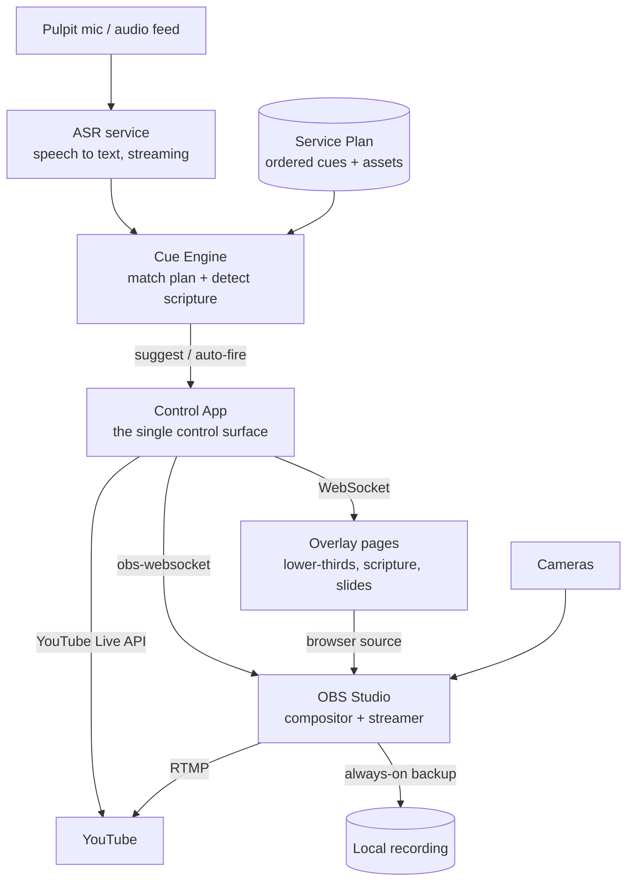

# Verger — a one-operator live service production system

**Working title:** *Verger* (a verger is the person who quietly keeps a service running smoothly so everyone else can focus — which is exactly what this software does). Rename freely.

---

## 1. The problems, restated

You are the only tech engineer, and a live service currently demands more hands than you have:

1. **Slide/video following** — someone has to watch the sermon and advance slides and roll videos at the right moment.
2. **Going live** — starting the YouTube stream takes too many clicks across too many windows.
3. **Lower-thirds + cameras** — you fake lower-thirds with a transparent PowerPoint, and every change forces you to switch *both* the slide *and* the camera, which is fiddly and error-prone.

All three collapse into one root cause: **the layers of your production (camera, overlay, slides, stream) are tangled together, and every action is manual.** The fix is to (a) separate the layers so each is controlled independently, and (b) put one smart control surface on top that automates the predictable parts while always leaving you in charge.

---

## 2. Design principles

These shape every decision below.

- **Human-in-the-loop, always.** Live service = zero tolerance for a wrong automated action. The system *suggests* and *pre-loads*; you confirm with one tap. Full auto is opt-in, per-cue, and always overridable.
- **Decouple the layers.** Camera, lower-third, slide, and scripture are independent layers. Changing one never disturbs another. This alone kills problem #3.
- **OBS is the resilient engine; the app is a convenience layer.** If your control app crashes, OBS keeps streaming and you can still drive it by hand. The app must never be a single point of failure for the live output.
- **Degrade gracefully.** Internet drops, speech recognition stumbles, a source crashes — none of these should stop the service. Each has a defined fallback.
- **One operator, low cognitive load.** Big touch targets, a foot pedal for hands-free confirm, and a screen you can read at a glance in a dark booth.

---

## 3. System architecture



**Components:**

- **Control App** — the one screen you actually touch. A local web app (open it on a tablet or second monitor) or an Electron desktop app. It talks to everything else and shows you what's coming next.
- **OBS Studio** — the compositor and streaming engine. It holds your cameras, overlays, and slides as layers, mixes them, and pushes RTMP to YouTube. Controlled programmatically via **obs-websocket v5**.
- **ASR service** — real-time speech-to-text on the pulpit mic. Produces a running transcript.
- **Cue Engine** — the brain. Reads the transcript, figures out where the speaker is in the plan, detects scripture references, and decides what to trigger.
- **Overlay pages** — plain HTML/CSS/JS pages loaded into OBS as *browser sources*. They render lower-thirds, scripture, and slide content, and update live over a WebSocket. Because they're a separate layer, they persist across camera switches.
- **Service Plan** — the authored order of service: slides, media, scripture, and cue triggers.
- **YouTube integration** — the Live Streaming API, so one button creates the broadcast, starts the stream, and goes live.

---

## 4. Feature 1 — Slide & video auto-following

This is the hard one, so it's designed to be *useful even when it can't be perfect* (pastors go off-script).

### How it works

1. **ASR** transcribes the mic in near-real-time, emitting partial results every ~200–500 ms.
2. The **Cue Engine** holds your **Service Plan** — an ordered list of cues, each with a *trigger* (the words expected around when it should fire) and a *payload* (the slide/video to show).
3. It keeps a **position pointer** (roughly where the speaker is) and a small **look-ahead window** of the next few cues. It fuzzy-matches the recent transcript against those upcoming triggers.
4. When a match crosses a threshold, the cue either **fires automatically** (auto mode) or **lights up as the suggested next action** (assist mode). The next slide is **pre-loaded** so firing is instant.

### Three parallel detectors

Running the plan is only one input. Two more work *regardless of script*:

- **Scripture detector** — watches for references like "요한복음 3장 16절", "Romans chapter 8", "turn to John 3:16." On a confident hit it fetches the verse and offers a scripture overlay/slide. This works even in fully extemporaneous preaching — often the single highest-value feature.
- **Hot-phrase detector** — you define phrases → actions ("let's pray" → prayer slide; "let's welcome" → welcome loop; "받으실 말씀은" → prime the scripture slide).

### The trust dial (this is what makes it safe)

- **Assist mode (default):** the system highlights the next likely cue; you confirm with a tap or foot pedal. Massive workload cut, near-zero risk.
- **Auto mode:** high-confidence cues fire on their own; low-confidence ones wait for you. You watch and can veto.
- **Manual mode:** system just shows passive suggestions; you drive.

Set the mode per service, or even per cue (e.g., auto-fire routine slides, always-confirm the sermon video).

### Why it degrades well

Off-script preaching breaks strict alignment — so the plan-follower quietly waits while the **scripture and hot-phrase detectors keep working**, and manual override is always one tap away. You never get stuck.

---

## 5. Feature 2 — One-click YouTube Live

Everything behind a single **GO LIVE** button:

1. **Create the broadcast** — `liveBroadcasts.insert` with a templated title/description ("Sunday Service — {date}"), privacy, scheduled start, and thumbnail.
2. **Attach the stream** — reuse a **persistent live stream** so the RTMP key never changes and OBS stays pre-configured; bind it to the broadcast (`liveBroadcasts.bind`).
3. **Start OBS streaming** — `StartStream` over obs-websocket, pushing to YouTube's ingest.
4. **Wait for health, then transition** — poll until the stream is healthy, then `liveBroadcasts.transition` to `live`.
5. **END button** — `transition` to `complete` + `StopStream`.

**Details that matter:**
- One-time Google **OAuth** consent; store the refresh token so future go-lives are silent.
- A **reusable stream** keeps the key stable — simplest and most reliable. The app just re-templates the title/thumbnail each week.
- YouTube's API has a daily quota; a handful of services per day is comfortably within it.
- Start OBS's **local recording at the same time**, always — your backup if the internet wobbles mid-stream.

---

## 6. Feature 3 — Independent lower-thirds & camera switching

The core fix: **the lower-third is its own layer, not a slide.**

### Lower-thirds

- OBS scene = camera source(s) **+ a persistent "Overlays" browser source on top.**
- That browser source loads a local overlay page listening on a WebSocket.
- The app sends `{ type: "lowerthird", action: "show", line1: "홍길동", line2: "찬양 인도" }` → the page animates it in with CSS. `hide` animates it out.
- Because it's a separate layer, **switching cameras never touches it, and showing a lower-third never touches the camera.** That's the end of "switch the slide *and* the camera every time."

### Camera switching

- Each camera is an OBS scene (or a source you toggle). The app has plain buttons — **CAM 1 / CAM 2 / WIDE / PULPIT** — mapped to `SetCurrentProgramScene` or source toggles.
- Transitions (cut/fade/stinger) are configured once in OBS and reused.
- Optional: a foot pedal or stream-deck-style buttons for camera changes so your hands stay free.

You now operate cameras and overlays as two independent controls instead of one tangled PowerPoint.

---

## 7. The Service Plan (data model)

A **Service** is an ordered list of **Cues**. Rough shape:

```jsonc
{
  "service": "2026-07-26 Sunday",
  "defaultMode": "assist",
  "cues": [
    {
      "id": "welcome",
      "type": "scene",            // scene | slide | media | scripture | lowerthird | action
      "label": "Welcome loop",
      "trigger": { "mode": "manual" },
      "payload": { "scene": "Welcome" }
    },
    {
      "id": "point-1",
      "type": "slide",
      "label": "Point 1 — Grace",
      "trigger": { "mode": "anchor", "text": "the first thing I want us to see is grace" },
      "payload": { "asset": "slides/point1.png" },
      "options": { "autoFireThreshold": 0.82 }
    },
    {
      "id": "sermon-video",
      "type": "media",
      "label": "Testimony video",
      "trigger": { "mode": "hotphrase", "text": "let's watch this" },
      "payload": { "asset": "media/testimony.mp4" },
      "options": { "confirmAlways": true }
    }
  ]
}
```

- `trigger.mode`: `manual` (you fire it), `anchor` (fuzzy-match transcript to `text`), `scripture` (fire on a detected reference), or `hotphrase`.
- **Authoring:** a simple editor, but also **import your existing PowerPoint slides** so you don't rebuild everything — the images become slide payloads and you just attach triggers.

---

## 8. Recommended tech stack

| Layer | Recommendation | Notes |
|---|---|---|
| Compositor / streamer | **OBS Studio** | Free, rock-solid, scriptable via obs-websocket v5 |
| Control app | **Electron** or local **Node/Express + React** | Tablet-friendly; add foot-pedal via keyboard/MIDI HID |
| Overlays | **HTML/CSS/JS** browser sources | Driven over WebSocket; independent layer |
| Speech-to-text | **Local:** faster-whisper (needs a decent GPU) · **Cloud:** Deepgram or Google STT | See trade-offs below |
| Scripture data | Local Bible DB or an API | Mind translation copyright; lyrics need CCLI |
| YouTube | **Live Streaming API** (Data API v3) | OAuth2 + stored refresh token |
| Cue matching (optional AI) | Fuzzy string match + scripture regex; optionally a small LLM for semantic matching | Keep it optional and behind the human-in-the-loop |

**Local vs cloud ASR:**

- **Local (Whisper family):** private, no per-minute cost, works if internet dies — but needs a capable GPU and more setup, and streaming latency depends on your hardware.
- **Cloud (Deepgram / Google):** lowest latency, strong Korean support, custom vocabulary for names and church-specific terms — but costs per minute and depends on your connection (which you need for streaming anyway). Deepgram's newer models are a good starting point for low-latency Korean.

Either way, add **custom vocabulary / keyword boosting** for your pastor's name, church name, hymn titles, and recurring terms — it sharply improves accuracy on exactly the words that matter.

---

## 9. Failure modes & safeguards

| Failure | Safeguard |
|---|---|
| Internet drops mid-stream | OBS auto-reconnect + **always-on local recording** as backup |
| ASR errors / service down | Auto-fall back to manual; clear status light; never blocks you |
| Wrong auto-trigger | Assist mode + instant override + one-tap **BACK/undo** |
| Overlay browser source crashes | Watchdog reloads it; overlay re-syncs state on reconnect |
| Control app crashes | OBS keeps streaming; relaunch app and it reconnects to OBS's current state |
| Operator overload | Foot pedal to confirm; "panic → full manual" master switch |

---

## 10. Build in phases (front-load the pain relief)

Ordered so the **biggest relief with the lowest risk comes first**, and the hard AI parts only land *after* a reliable manual system exists as their fallback.

- **Phase 0 — Foundation (~1 week).** OBS with per-camera scenes + a persistent overlay browser source; control-app skeleton connected to OBS; camera buttons + a manual lower-third input. ➜ *Immediately ends the transparent-PowerPoint pain (#3).*
- **Phase 1 — One-click live.** GO LIVE / END buttons via the YouTube API + auto-record backup. ➜ *Ends the many-clicks pain (#2).*
- **Phase 2 — Ears.** ASR integration + scripture auto-detect in **assist mode**. ➜ *High value, works even off-script.*
- **Phase 3 — Following.** Service Plan authoring + PowerPoint import + slide/media auto-follow (assist → optional auto). ➜ *The full #1.*
- **Phase 4 — Polish.** Foot pedal, confidence tuning, weekly templates, multi-language, a small monitoring dashboard.

After Phase 1 you already have a dramatically calmer Sunday. Phases 2–3 are where the "extra arms" show up.

---

## 11. Decisions to make before building

A few answers will steer the stack. My current assumptions in brackets:

1. **Operating system?** [Windows assumed — affects OBS setup and whether local GPU Whisper is practical.]
2. **Language(s) of the service?** [Korean, possibly with some English — drives the ASR choice.]
3. **Does the pastor preach from a script/outline, or freely?** Scripted ➜ slide auto-follow works well. Free ➜ lean on scripture + hot-phrase detection and assist mode.
4. **Local or cloud ASR?** Weigh privacy + offline resilience vs. latency + easy setup.
5. **Are you already on OBS, or only PowerPoint today?** [Assumed PPT-only; Phase 0 introduces OBS.]
6. **How many cameras, and how do you switch them now?**
7. **Any budget for cloud services (ASR, hosting)?**

---

## 12. One-paragraph summary

Make OBS the calm, resilient engine that holds cameras, overlays, and slides as **independent layers**; put a single **control app** on top that gives you one-tap camera and lower-third controls (no more tangled PowerPoint), a **GO LIVE** button that drives the YouTube API end-to-end, and an **ASR-fed cue engine** that listens to the sermon and — safely, with you confirming — pre-loads and advances slides while auto-detecting scripture. Build the manual foundation first so the automation always has a trustworthy fallback. That's the extra pair of arms.
