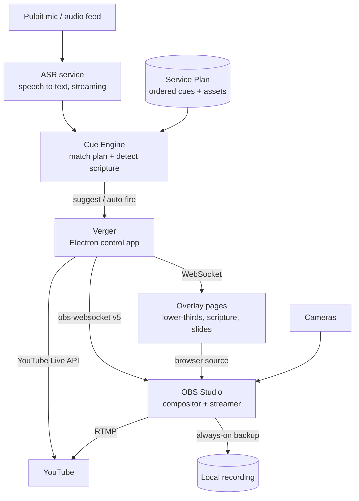

# Verger

**A one-operator live-service production control app.**

Verger is an Electron desktop app that sits on top of OBS Studio and gives a single person the
control surface a whole production team would otherwise need: one-tap camera switching,
lower-thirds that live on their own layer, a single GO LIVE button that drives the YouTube Live
API end to end, and — later — a speech-driven cue engine that follows the sermon and pre-loads the
next slide for you to confirm.

The name is deliberate: a verger is the person who quietly keeps a service running smoothly so
everyone else can focus. That is the job description.

> The immutable product spec is [`BLUEPRINT.md`](./BLUEPRINT.md). This README describes what the
> repository currently *is*; the blueprint describes what "done" means.

---

## The three problems it solves

Verger exists to fix three specific pains for a solo tech operator running a live service:

1. **Slide & video following.** Somebody has to watch the sermon and advance slides and roll videos
   at the right moment. Verger listens to the pulpit mic, tracks position in a Service Plan,
   detects scripture references, and *suggests* the next cue for one-tap confirmation.
2. **Going live.** Starting the YouTube stream takes too many clicks across too many windows.
   Verger collapses create-broadcast → bind-stream → start-OBS → wait-for-health → transition-live
   into one button, with local recording always started alongside as the backup.
3. **Lower-thirds and cameras.** Faking lower-thirds with a transparent PowerPoint forces you to
   switch *both* the slide *and* the camera for every change. Verger makes the overlay an
   independent layer (an OBS browser source driven over a WebSocket), so a camera switch never
   touches the overlay and showing an overlay never touches the camera.

All three share one root cause: the layers of the production are tangled together and every action
is manual. The fix is to separate the layers and put one smart control surface on top.

---

## Architecture



The load-bearing principle: **OBS is the resilient engine; Verger is a convenience layer.** If
Verger crashes, OBS keeps streaming and recording, and you can still drive it by hand. On relaunch,
Verger *reads* OBS's current state rather than imposing its own. Verger must never be a single
point of failure for the live output.

For the process model, the IPC surface, and the module layout, see
[`docs/ARCHITECTURE.md`](./docs/ARCHITECTURE.md).

---

## Current status

**Phase 1 of 10 — Foundation: Electron shell + OBS connection + governance.**

The ten phases are defined in [`verger_build_prompts.md`](./verger_build_prompts.md) and the
running log is [`STATUS.md`](./STATUS.md).

| Phase | Scope | State |
|---|---|---|
| 0 | Bootstrap: repo, governance docs, v2 prior-art mining | Done |
| **1** | **Electron shell, typed IPC bridge, OBS client + Connection screen, config/secrets, i18n, logging** | **In progress** |
| 2 | Layered scenes, overlay HTTP/WebSocket server, message bus | Not started |
| 3 | Camera switching + independent lower-thirds | Not started |
| 4 | YouTube Live part A — OAuth + broadcast lifecycle | Not started |
| 5 | YouTube Live part B — GO LIVE / END orchestration + auto-record | Not started |
| 6 | Service Plan data model, authoring editor, PowerPoint import | Not started |
| 7 | Pluggable ASR (Deepgram cloud + faster-whisper local) | Not started |
| 8 | Cue Engine — scripture detector, hot-phrases, plan follower, trust dial | Not started |
| 9 | Resilience & safeguards | Not started |
| 10 | Polish, monitoring, packaging, end-to-end | Not started |

Nothing beyond Phase 1 is built. Where this repo's docs describe a later phase, they describe the
*plan*, and say so.

### About OBS on the development machine

**OBS Studio is not installed on the development machine, and no live OBS connection has been made
from this repo.** Everything Verger knows about OBS is therefore exercised by **mock-based unit
tests**: the obs-websocket client is unit tested against a fake socket (connect, disconnect, auth
failure, reconnect backoff, state transitions), never against a live instance. No test in this repo
may require a running OBS, a network, or a real Electron runtime.

Installing OBS and enabling its WebSocket server is tracked as a human task in
[`HUMAN_TASKS.md`](./HUMAN_TASKS.md). Until that happens, the Connection screen is expected to show
"Not configured" (empty `OBS_WEBSOCKET_URL`) or "Down" — which is the designed behaviour, not a
failure.

---

## Quick start

### Prerequisites

- **Node.js ≥ 20** and **npm ≥ 10** (see `engines` in `package.json`; developed on Node 24 / npm 11).
- **Windows** is the primary target. The build tooling is cross-platform, but packaging is
  configured for Windows.
- **OBS Studio 30 or newer**, with the WebSocket server enabled — *optional for development*, and
  required only to see a real connection. In OBS: `Tools → WebSocket Server Settings` → tick
  **Enable WebSocket server**, note the port (default `4455`), and click **Show Connect Info** to
  copy the password.

### Install and run

```bash
git clone https://github.com/kimbolt1109/rhema_v3.git
cd rhema_v3

cp .env.example .env      # Windows: copy .env.example .env
npm install
npm run dev
```

`.env` is gitignored. Every key in it may be left empty — an empty value means "run that subsystem
in not-configured mode", never a crash. To point Verger at a local OBS, fill in:

```ini
OBS_WEBSOCKET_URL=ws://127.0.0.1:4455
OBS_WEBSOCKET_PASSWORD=<the password from Show Connect Info>
```

An empty `OBS_WEBSOCKET_PASSWORD` is valid and means OBS has authentication disabled.

`npm run dev` starts the electron-vite dev server on `127.0.0.1:5273` (strict port) and launches the
Electron shell against it with HMR.

---

## npm scripts

| Script | What it does |
|---|---|
| `npm run dev` | electron-vite dev server + Electron shell, with HMR |
| `npm start` | `electron-vite preview` — run the built output without packaging |
| `npm run build` | `typecheck` then `electron-vite build` (main + preload + renderer into `out/`) |
| `npm run typecheck` | Both projects: `typecheck:node` then `typecheck:web` |
| `npm run typecheck:node` | `tsc --noEmit -p tsconfig.node.json` — main, preload, shared, build configs |
| `npm run typecheck:web` | `tsc --noEmit -p tsconfig.web.json` — renderer + shared, **no Node types** |
| `npm test` | Vitest in watch mode |
| `npm run test:run` | Vitest once (both `node` and `renderer` projects) |
| `npm run test:coverage` | Vitest once with v8 coverage |
| `npm run test:e2e` | Playwright end-to-end (wired in Phase 10) |
| `npm run package` | Build, then `electron-builder --win` (Phase 10) |

Run a single Vitest project with `npx vitest run --project node` or `--project renderer`.

---

## Where things are

| File / folder | What it is |
|---|---|
| [`BLUEPRINT.md`](./BLUEPRINT.md) | **Immutable** product spec. Defines "done". Never edited. |
| [`CLAUDE.md`](./CLAUDE.md) | Build governance: the 8 standing rules, architecture invariants, the phase loop, and what is out of scope. |
| [`verger_build_prompts.md`](./verger_build_prompts.md) | **Immutable** 10-phase decomposition of the blueprint. |
| [`STATUS.md`](./STATUS.md) | Running build log — one appended cycle entry per completed phase. |
| [`HUMAN_TASKS.md`](./HUMAN_TASKS.md) | Escalation list for anything only a human can do: accounts, keys, certs, legal, hardware. The build never blocks on these. |
| [`docs/ARCHITECTURE.md`](./docs/ARCHITECTURE.md) | Process model, IPC surface, OBS state machine, config contract, planned module layout. |
| [`docs/DEVELOPMENT.md`](./docs/DEVELOPMENT.md) | Prerequisites, the dev loop, testing philosophy, file-layout conventions, phase workflow. |
| [`docs/v2-notes/`](./docs/v2-notes/) | Distilled prior art mined from the earlier `rhema_v2` (Tauri/Rust) build: protocol design, validated thresholds, a11y numbers, legal obligations, and a 107-item audit of how that build went wrong. Reference, not gospel — `BLUEPRINT.md` wins on any conflict. |
| `src/` | Application source: `main/` (Node), `preload/` (CJS bridge), `renderer/` (React), `shared/` (types + Zod schemas, no Node globals). |
| `.env.example` | The secrets contract — every key name, all empty. |

---

## Non-negotiables

These are enforced across every phase (full list in [`CLAUDE.md`](./CLAUDE.md)):

- **Human always wins.** Every automated action is overridable in one tap. Assist mode is the
  default; auto-fire is opt-in per cue.
- **OBS is the resilient engine.** Verger reconnects to OBS's state; it never imposes state.
- **Always-on local recording.** Whenever streaming starts, OBS local recording starts too.
- **Never emit bulk copyrighted text.** No verse text or lyrics in code or fixtures. Copyrighted
  translations are fetched live from a licensed API with attribution; only verified public-domain
  data is bundled.
- **Empty env key = degraded, never crash.** No missing secret may take the app down, and no secret
  *value* is ever logged.
- **Loopback-first networking.** Servers bind `127.0.0.1`; LAN exposure needs an explicit opt-in
  plus a concrete IP. There is no wildcard-bind code path.
- **Holds, not taps, for destructive actions.** Handing back control from the AI is instant and
  non-destructive; anything that clears live output requires a deliberate hold.
- **Dark, high-contrast booth theme.** Large touch targets, never colour alone for status,
  `prefers-reduced-motion` honoured.

---

## Licence

UNLICENSED / private. See `package.json`.
