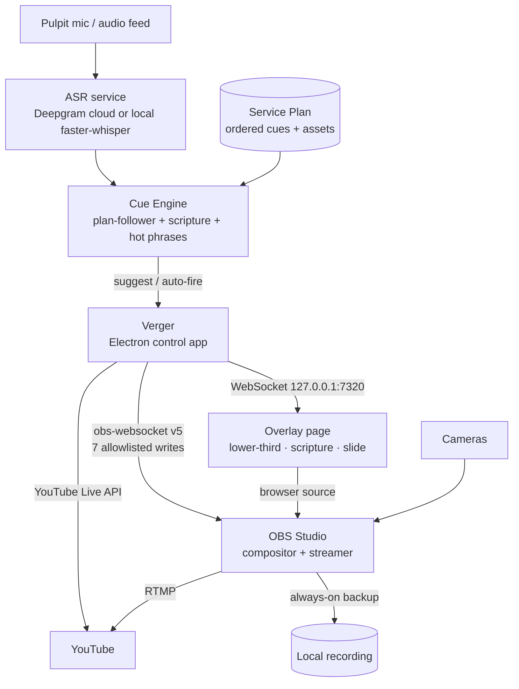

# Verger

**A one-operator live-service production control app.**

Verger is a Windows desktop app (Electron) that sits on top of OBS Studio and gives a single person
the control surface a whole production team would otherwise need: one-tap camera switching,
lower-thirds that live on their own layer, a single GO LIVE button that drives the YouTube Live API
end to end with a local recording always started alongside it, and a speech-driven cue engine that
follows the sermon and offers the next cue for you to confirm.

The name is deliberate: a verger is the person who quietly keeps a service running smoothly so
everyone else can focus. That is the job description.

> **Read this before you read anything else.**
>
> This build has **never connected to a real OBS Studio, a real Google/YouTube account, or
> Deepgram.** None of the three exists on the machine it was built on, and no credentials are
> coming. Every one of those subsystems is built, typechecked and unit-tested against injected
> fakes — which proves the logic and proves nothing about the wire. The local speech recogniser
> *has* been run for real on this machine; nothing else external has.
>
> **The Windows installer is unsigned.** There is no code-signing certificate for this project, so
> SmartScreen will warn on first run and `electron-updater` cannot safely auto-update it. That
> warning is correct.
>
> The honest, per-phase list of what was and was not verified is in [`STATUS.md`](./STATUS.md),
> under each cycle's **"Not verified"** heading. It is the most useful file in this repository.

---

## The three problems it solves

1. **Slide & video following.** Somebody has to watch the sermon and advance slides and roll videos
   at the right moment. Verger listens to the pulpit mic, tracks position in a Service Plan,
   detects scripture references, and *suggests* the next cue for one-tap confirmation.
2. **Going live.** Starting the YouTube stream takes too many clicks across too many windows.
   Verger collapses create-broadcast → bind-stream → start-OBS → wait-for-health → transition-live
   into one button, with local recording always started alongside as the backup.
3. **Lower-thirds and cameras.** Faking lower-thirds with a transparent PowerPoint forces you to
   switch *both* the slide *and* the camera for every change. Verger makes the overlay an
   independent layer (an OBS browser source driven over a WebSocket), so a camera switch never
   touches the overlay and showing an overlay never touches the camera.

All three share one root cause: the layers of the production are tangled together and every action
is manual. The fix is to separate the layers and put one smart control surface on top.

---

## Architecture



The load-bearing principle: **OBS is the resilient engine; Verger is a convenience layer.** If
Verger crashes, OBS keeps streaming and recording, and you can still drive it by hand. On relaunch,
Verger *reads* OBS's current state and adopts it rather than imposing its own. Verger must never be
a single point of failure for the live output.

Three structural consequences, each enforced by tests rather than by convention:

- **The OBS client refuses any request outside a seven-name write allowlist** before it reaches the
  socket. Connecting and reconnecting issue only `Get*` requests, so launching Verger mid-service
  cannot push a second stream.
- **The overlay protocol is state-based, not event-based.** Every mutation broadcasts a full
  snapshot and a snapshot is sent on connect, so an overlay that crashes and reloads comes back
  showing the right thing. Resync is not a special case; it is the only case.
- **The primitive that starts a stream takes zero arguments**, so there is no flag or overload by
  which a stream can start without a local recording.

For the process model, the IPC surface and the module layout see
[`docs/ARCHITECTURE.md`](./docs/ARCHITECTURE.md); for how the composition root is guarded, see
[`docs/WIRING.md`](./docs/WIRING.md).

---

## Feature status — what is built, and what that claim is worth

All ten phases are complete. "Built" here means implemented, typechecked and unit-tested;
"verified" means *observed working on this machine*. The distinction is the whole point of this
table.

| Capability | Built | Verified how | Not verified |
|---|---|---|---|
| Electron shell, sandboxed CJS preload, typed IPC bridge (53 request channels) | Yes | App launched; `window.verger` exposed; `window.require` and `window.process` absent | — |
| OBS connection, state machine, unbounded reconnect with backoff, terminal auth-failure | Yes | Unit tests against a fake socket with fake timers | **Never spoken to a real OBS.** OBS Studio is not installed on this machine |
| Camera switching (4 slots), per-slot transitions, OBS-side scene changes reflected back | Yes | Unit + UI tests against a mock | Has never moved a real program scene |
| Overlay server (Express + `ws` on `127.0.0.1:7320`), state cache, resync on reconnect | Yes | **Live app**: page fetched over HTTP 200, a raw socket received a full state snapshot on open before sending anything | **Never loaded as a real OBS Browser Source.** Transparency over live video rests on CSS review, not observation |
| Independent lower-third / scripture / slide layers | Yes | 40 reducer tests assert the two untargeted layers are referentially identical for *every* command; UI tests assert a camera press sends zero overlay commands and vice versa | Not composited over live video |
| Google OAuth (loopback, `safeStorage` refresh token), broadcast create/bind, persistent stream reuse | Yes | Unit tests against injected mocks, zero network; a test scans every log call for the refresh token, client secret and auth code | **No Google credentials exist and none are coming.** The real OAuth round-trip and the YouTube request shapes are unproven |
| GO LIVE / END orchestration, `partial` state, always-on recording, crash re-attach | Yes | Unit tests; `wiring.test.ts` proves `initialize()` adopts an already-streaming OBS without issuing start/stop | **No real stream or recording has ever been started.** obs-websocket field names come from the protocol spec, not a live handshake |
| Service Plan: cue model, editor with keyboard-accessible reordering, atomic save, manual driver | Yes | Unit + UI tests; an imported image round-trips byte-for-byte over the overlay server's `/assets` route | — |
| PowerPoint import (LibreOffice headless, hardened zip reader) | Yes | Unit tests over crafted archives incl. zip-bomb, entry-count and path-traversal limits | **LibreOffice is not installed; no real deck has been converted.** The Import button is disabled and says why |
| ASR: Deepgram cloud adapter | Yes | Unit tests against a mock, zero network | **No Deepgram key exists and none is coming.** Korean accuracy, real latency and the keyword-boost parameter name are all unproven |
| ASR: local faster-whisper sidecar | Yes | **Measured on this machine**: `ctranslate2` CUDA device count 1 (GTX 1650 4 GB); `tiny` load 0.8 s, 3 s of audio in 0.12 s; two real-sidecar integration tests pass | **No real speech has been transcribed** — synthesised tones only |
| Cue engine: plan-follower, scripture detector (EN + KO), hot phrases, trust dial, PANIC | Yes | Unit tests on synthetic transcripts; ReDoS measured at 1.35 ms against a 50 ms budget over nine adversarial inputs | Korean detection accuracy on a real sermon, and end-to-end speech→suggestion latency, are unproven |
| Scripture text resolution (ESV / API.Bible / public-domain catalogue) | Partly | The resolver is written and unit-tested | **Not connected in the composition root.** `cueResolveScripture` answers *not configured*, so a detected reference is offered without its text and never auto-shown. See [`docs/WIRING.md`](./docs/WIRING.md) §4 |
| Health dashboard: 7 subsystem lights, "is the service still going out?", recovery actions | Yes | Unit + UI tests; one failure-injection test per [`BLUEPRINT.md`](./BLUEPRINT.md) §9 row | Every failure is *simulated* through an injected seam. No real internet drop, OBS crash or browser-source failure has been observed |
| Composition-root wiring test | Yes | **Verified by reintroducing a real bug**: the Phase 8 "engine with no ASR source" defect was put back and the suite went red on the right assertion, then reverted | — |
| Windows NSIS installer | Yes | `electron-builder --win` produces `release/0.1.0/Verger-0.1.0-x64-setup.exe` (~93 MB) plus an unpacked tree | **Unsigned** — no certificate exists, so SmartScreen will warn and auto-update is off with no update manifest published. **Not yet installed on a clean Windows profile** |

Counts as of the Phase 9 cycle entry in [`STATUS.md`](./STATUS.md): **1,738 tests across 59 files**,
`tsc --noEmit` clean on both projects, `electron-vite build` succeeding, and the app launching with
**53 IPC channels**. Phase 10 adds to those numbers; `STATUS.md` is the running record.

### The bug class this build kept producing, and what was done about it

Four separate times a component was written, fully unit-tested, reviewed and merged green — and
connected to **nothing**: the overlay server was never started, the OAuth session was never
restored, the go-live re-attach was never initialised, and the cue engine was built with neither a
transcript source nor a detector. Each one passed every test in the repository.

`src/main/wiring.test.ts` now exercises the real composition root, and
[`docs/WIRING.md`](./docs/WIRING.md) documents the pattern and the checklist for adding a subsystem
without becoming instance number five. If you read one design document in this repo, read that one.

---

## Quick start

Full first-run instructions, including every optional extra and its degraded mode, are in
**[`docs/GETTING_STARTED.md`](./docs/GETTING_STARTED.md)**.

### Prerequisites

- **Windows 10/11 x64.**
- **OBS Studio 30 or newer** with `Tools → WebSocket Server Settings → Enable WebSocket server`
  ticked. Note the port (default `4455`) and click *Show Connect Info* for the password.
- **Node.js 20+ / npm 10+** — for running from source only (developed on Node 24 / npm 11).

### Install and run

```bash
git clone https://github.com/kimbolt1109/rhema_v3.git
cd rhema_v3

copy .env.example .env     # POSIX shell: cp .env.example .env
npm install
npm run dev
```

`.env` is gitignored. **Every key in it is optional.** An empty value means "run that subsystem in
not-configured mode" — a specific, named, on-screen state — never a crash and never a silent
failure. To point Verger at a local OBS:

```ini
OBS_WEBSOCKET_URL=ws://127.0.0.1:4455
OBS_WEBSOCKET_PASSWORD=<the password from Show Connect Info>
```

An empty `OBS_WEBSOCKET_PASSWORD` is valid and means OBS has authentication disabled.

With a completely empty `.env` you still get: all four camera buttons, independent lower-thirds and
overlay layers, the full Service Plan authoring and manual driver, GO LIVE / END with always-on
local recording, crash re-attach, the health dashboard and its recovery actions, PANIC, and the
EN/KO booth UI. What you lose is speech recognition, deck import and a YouTube link.

---

## npm scripts

| Script | What it does |
|---|---|
| `npm run dev` | electron-vite dev server + Electron shell, with HMR |
| `npm start` | `electron-vite preview` — run the built output without packaging |
| `npm run build` | `typecheck` then `electron-vite build` (main + preload + renderer into `out/`) |
| `npm run typecheck` | Both projects: `typecheck:node` then `typecheck:web` |
| `npm run typecheck:node` | `tsc --noEmit -p tsconfig.node.json` — main, preload, shared, build configs |
| `npm run typecheck:web` | `tsc --noEmit -p tsconfig.web.json` — renderer + shared, **no Node types** |
| `npm run i18n:audit` | Checks EN/KO locale coverage and finds un-extracted strings |
| `npm test` | Vitest in watch mode |
| `npm run test:run` | Vitest once (both the `node` and `renderer` projects) |
| `npm run test:coverage` | Vitest once with v8 coverage |
| `npm run test:e2e` | Playwright end-to-end |
| `npm run package` | Build, then `electron-builder --win` → an **unsigned** NSIS installer in `release/<version>/` |

Run a single Vitest project with `npx vitest run --project node` or `--project renderer`.
No test in this repository may require a running OBS, a network, a GPU or an Electron runtime.

---

## Documentation map

| File | What it is |
|---|---|
| [`docs/GETTING_STARTED.md`](./docs/GETTING_STARTED.md) | **Start here.** First run in the order a real person does it, every optional key and what it unlocks, and what works with none of them. |
| [`docs/RUNBOOK.md`](./docs/RUNBOOK.md) | **The service-day sheet.** T-30 checks, going live, during, one section per failure with the exact operator action, and after. |
| [`docs/SHORTCUTS.md`](./docs/SHORTCUTS.md) | The keyboard card — print it and tape it to the booth keyboard. Includes why ESC is non-destructive and what PANIC will never do. |
| [`docs/OBS_SETUP.md`](./docs/OBS_SETUP.md) | The OBS scene contract, the exact browser-source settings, and the overlay troubleshooting tree. |
| [`docs/ARCHITECTURE.md`](./docs/ARCHITECTURE.md) | Process model, IPC surface, OBS state machine, overlay protocol, config contract, the write allowlist. |
| [`docs/WIRING.md`](./docs/WIRING.md) | The composition root, the four "built but connected to nothing" defects, and the checklist for adding a subsystem. |
| [`docs/DEVELOPMENT.md`](./docs/DEVELOPMENT.md) | Prerequisites, the dev loop, testing philosophy, file-layout conventions, phase workflow. |
| [`BLUEPRINT.md`](./BLUEPRINT.md) | **Immutable** product spec. Defines "done". Never edited. |
| [`CLAUDE.md`](./CLAUDE.md) | Build governance: the 8 standing rules, architecture invariants, the phase loop, what is out of scope. |
| [`verger_build_prompts.md`](./verger_build_prompts.md) | **Immutable** 10-phase decomposition of the blueprint. |
| [`STATUS.md`](./STATUS.md) | Running build log — one appended cycle entry per phase, each with an honest "Not verified" section. |
| [`HUMAN_TASKS.md`](./HUMAN_TASKS.md) | Everything only a human can do: accounts, keys, certificates, legal calls, hardware — with exact steps, plus the list of verifications only a real environment can provide. The build never blocks on these. |
| [`NOTICE.md`](./NOTICE.md) | Third-party licence notices for everything bundled into a build. Generated by `scripts/generate-notice.mjs`; do not edit by hand. |
| [`docs/v2-notes/`](./docs/v2-notes/) | Distilled prior art from the earlier `rhema_v2` (Tauri/Rust) build: protocol design, validated thresholds, a11y numbers, legal obligations, and a 107-item audit of how that build went wrong. Reference, not gospel — `BLUEPRINT.md` wins on any conflict. |
| `src/` | `main/` (Node), `preload/` (sandboxed CJS bridge), `renderer/` (React), `overlay/` (framework-free page), `shared/` (types + Zod schemas, no Node globals). |
| `.env.example` | The secrets contract — every key name, all empty. |

---

## Non-negotiables

Enforced across every phase; the full list is in [`CLAUDE.md`](./CLAUDE.md).

- **Human always wins.** Every automated action is overridable in one tap. Assist mode is the
  default; auto-fire is opt-in per cue and nothing can force one.
- **OBS is the resilient engine.** Verger reconnects to OBS's state; it never imposes state.
- **Always-on local recording.** Whenever streaming starts, OBS local recording starts too.
- **Never emit bulk copyrighted text.** No verse text or lyrics in code or fixtures — the
  `scripture` cue payload has no `text` field, so a plan carrying verse text is invalid by
  construction. Copyrighted translations are fetched live from a licensed API with attribution;
  only verified public-domain data is bundled.
- **Empty env key = degraded, never crash.** No missing secret may take the app down, and no secret
  *value* is ever logged.
- **Loopback-first networking.** Servers bind `127.0.0.1`; there is no wildcard-bind code path.
- **Holds, not taps, for destructive actions.** Nothing destructive fires under 1500 ms. Handing
  control back from the AI is instant and non-destructive, and is on a different control from
  anything that clears the screen.
- **Dark, high-contrast booth theme.** Large touch targets, never colour alone for status,
  `prefers-reduced-motion` honoured.

---

## Licence

UNLICENSED / private. See `package.json`.

Third-party notices for everything bundled into a build are in [`NOTICE.md`](./NOTICE.md),
generated by `scripts/generate-notice.mjs` from the `dependencies` tree plus Electron. **No Bible
translation text, hymn text or song lyric is bundled with Verger in any form** — copyrighted
translations are fetched live with the operator's own API credentials and attributed at render
time.
