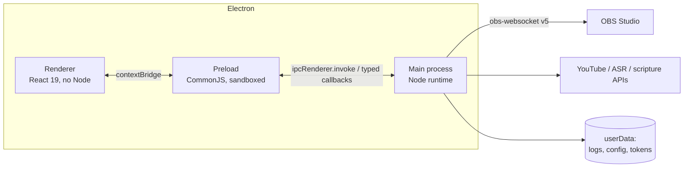
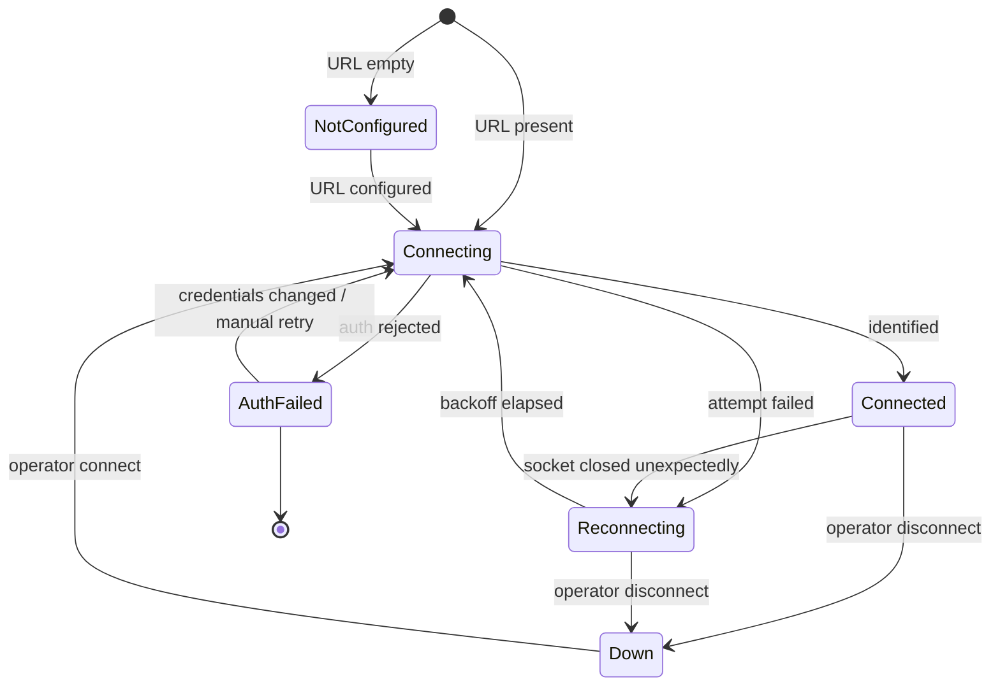
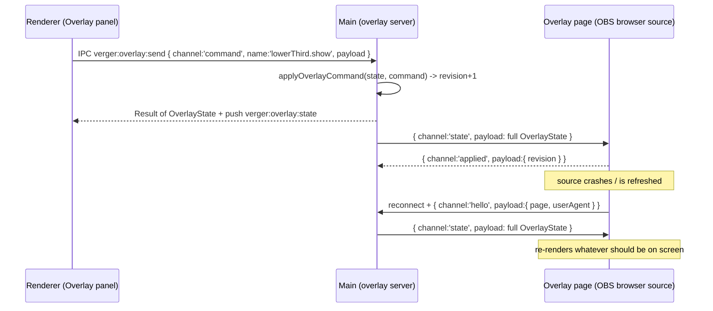

# Architecture

How Verger is put together, and why. The governing spec is [`../BLUEPRINT.md`](../BLUEPRINT.md);
the standing rules and architecture invariants are in [`../CLAUDE.md`](../CLAUDE.md). This document
explains the shape of the system and records the contracts each phase must satisfy.

---

## 0. Implementation status of this document

> **Read this before trusting any section below.**
>
> At the time this document was written, Phase 1 implementation was still in flight in parallel and
> only part of it had landed on disk. What existed and was read directly:
>
> - the verified build tooling — `package.json`, `electron.vite.config.ts`, the three tsconfigs,
>   `vitest.config.ts`, `tailwind.config.js`, `electron-builder.yml`, `.env.example`;
> - `src/main/config/env.ts` and `src/main/logging/logger.ts`.
>
> What did **not** exist: `src/shared/` (the protocol contract), `src/main/obs/`, `src/preload/`,
> `src/renderer/`.
>
> Consequently:
>
> | Section | Status |
> |---|---|
> | §1 Process model | **Verified** against the build configuration on disk. |
> | §2 Config & secrets | **Verified** against `.env.example` and `src/main/config/env.ts`. |
> | §3 IPC surface | **Contract, not inventory.** `src/shared/ipc.ts` did not exist. The conventions, envelope shape, error codes, and `safeHandle` steps below are binding requirements drawn from `CLAUDE.md` and `v2-notes/PROTOCOL.md`. **No channel is enumerated here, because inventing one would be worse than omitting it.** Replace this section with the real registry, read from `src/shared/ipc.ts`, once it exists. |
> | §4 OBS client state machine | **Contract, not inventory.** `src/shared/obs.ts` did not exist. The required states and transitions are derived from the Phase-1 prompt and Standing Rule 2; the concrete backoff numbers are explicitly *not yet chosen* and are marked as such. |
> | §5 OBS-is-the-engine | **Binding rule**, from `BLUEPRINT.md` §2 / Standing Rule 2. |
> | §6 Overlay layer | **Mixed — see the status box in §6.** The protocol, network constants, and IPC surface were read directly from `src/shared/{overlay,net,ipc}.ts` and are verified. The main-process server and the overlay page were being written in parallel and were **not on disk** when this section was written. |
> | §7 Phases 2–10 module layout | **Planned. NOT YET BUILT.** |
>
> Nothing in this file describes a running feature except where §1, §2, and §6 say "verified".

---

## 1. Process model

Verger is an Electron app with the standard three-process split, hardened.



### Main process — `src/main`

The only process with privilege. It owns:

- the `BrowserWindow`s and their `webPreferences`,
- **all** environment and config reading (`.env` is read here and nowhere else),
- the obs-websocket client and its reconnect loop,
- the file system: rolling log files and app state under Electron's `userData`,
- secret storage (Electron `safeStorage` for the YouTube refresh token, from Phase 4),
- every IPC handler,
- from Phase 2, the local overlay HTTP + WebSocket server, bound to `127.0.0.1`.

Built as ESM to `out/main/index.js` (`package.json` `main`), with `externalizeDeps: true` so
Electron, Node builtins, and runtime dependencies are resolved at runtime rather than bundled.

### Preload — `src/preload`

A bridge, not a layer of logic. It runs in an isolated world alongside the renderer and uses
`contextBridge.exposeInMainWorld` to publish a **small, explicitly enumerated, typed** API.

Two constraints here are structural, not stylistic:

1. **It is built to CommonJS at `out/preload/index.cjs`.** `package.json` declares
   `"type": "module"`, and Electron 38 loads an ESM preload *only* when the renderer runs with
   `sandbox: false`. Verger keeps `sandbox: true`, so the preload must be CJS, and the `.cjs`
   extension makes that explicit regardless of the surrounding package type. The main process must
   resolve exactly this path. Changing the preload's output format means changing `sandbox` too —
   they are one decision, not two.
2. **It never forwards raw `ipcRenderer`.** Not `ipcRenderer.on`, not `.send`, not the object.
   Exposing the raw object hands the renderer an un-typed, un-validated channel to every handler in
   main and defeats the whole boundary. Push events reach the renderer through single-purpose typed
   callbacks that the preload registers itself.

### Renderer — `src/renderer`

React 19 + Tailwind + Zustand. No Node, ever. Entry is exactly `src/renderer/index.html`; in dev it
is served from `127.0.0.1:5273` (strict port) and the main process picks it up via the
`ELECTRON_RENDERER_URL` that electron-vite exports.

`tsconfig.web.json` compiles the renderer with `types: ["vite/client"]` and **deliberately omits the
`@main/*` path alias**, so a renderer file that imports main-process code fails typecheck before it
can fail at bundle time. The renderer's only route to privilege is the preload bridge.

### Why `contextIsolation` and a sandboxed CJS preload matter *here* specifically

This is not generic Electron hygiene. Verger loads and will increasingly load content it does not
fully control: OBS scene names and source names typed by whoever set up the machine, service-plan
text, imported PowerPoint content, and scripture returned from third-party APIs. Any of that can
carry a string that ends up rendered.

With `contextIsolation: true`, `nodeIntegration: false`, and `sandbox: true`:

- renderer JavaScript executes in a separate V8 context from the preload, so page script cannot
  reach or monkey-patch the bridge's internals;
- the renderer process has no Node API surface to escalate into — an XSS in the booth UI is confined
  to the booth UI;
- the attack surface reachable from the renderer is exactly the list of functions the preload chose
  to expose, and each of those is validated in main before it does anything.

The cost is that the preload must be CommonJS. That is the trade, and it is worth it: this app runs
unattended in a booth while a service is being streamed to the public.

### Window hardening (required of every window)

- `contextIsolation: true`, `nodeIntegration: false`, `sandbox: true`, `webSecurity: true`,
  `allowRunningInsecureContent: false`, `webviewTag: false`.
- Navigation lockdown: `will-navigate` blocks any off-origin navigation;
  `setWindowOpenHandler(() => ({ action: 'deny' }))` blocks `window.open` and `target="_blank"`.
  External links go through `shell.openExternal` after scheme allow-listing (http/https/mailto only).
- Permissions denied by default via `setPermissionRequestHandler` / `setPermissionCheckHandler`;
  grant only what a specific window genuinely needs, and grant output/overlay windows **nothing**.
- A Content-Security-Policy with no `unsafe-eval`, `object-src 'none'`, `frame-ancestors 'none'`,
  `base-uri 'none'`.
- Any secondary window (overlay preview, output window) gets a **strict subset** of the operator
  window's bridge — state consumption only, no file, shell, or command surface. The prior project's
  audit records granting broad filesystem and shell capability to *every* window as one of its worst
  security defects; do not repeat it.

---

## 2. Config and secrets contract

**Verified against `.env.example` and `src/main/config/env.ts` on disk.**

Secrets live in `.env`, which is gitignored. Every key name is mirrored into `.env.example` with an
**empty** value. There are exactly eight keys, and the `ENV_KEYS` tuple / `EnvKey` union in
[`src/main/config/env.ts`](../src/main/config/env.ts) mirrors that file exactly, in file order — no
extras, no omissions:

| Key | Subsystem | Phase | Empty means |
|---|---|---|---|
| `OBS_WEBSOCKET_URL` | OBS | 1 | OBS panel shows "Not configured"; the reconnect loop stays **idle** rather than dialling. |
| `OBS_WEBSOCKET_PASSWORD` | OBS | 1 | **Valid** — OBS has authentication disabled. Not the same as "not configured". |
| `GOOGLE_CLIENT_ID` | YouTube OAuth | 4–5 | Go Live screen shows "Not connected"; YouTube actions disabled, not failing. |
| `GOOGLE_CLIENT_SECRET` | YouTube OAuth | 4–5 | as above |
| `DEEPGRAM_API_KEY` | Cloud ASR | 7 | Falls back to the local faster-whisper adapter; if that is unavailable, the cue engine degrades to fully manual. |
| `ESV_API_KEY` | Scripture | 8 | Only verified public-domain translations available. |
| `API_BIBLE_KEY` | Scripture | 8 | as above |
| `SENTRY_DSN` | Crash reporting | 9 | Crash reporting off; no telemetry leaves the machine. |

The rules around this contract:

- **An empty value is a supported operating mode, never an error.** Each subsystem boots into a
  typed "not configured" state, reports it in the UI, and the app runs fully offline with a
  completely empty `.env`. No missing key may crash or block startup.
- **Model the state as a discriminated union**, not a boolean plus a nullable field, so the renderer
  can be exhaustively gated on it and a new state cannot be silently ignored.
- **Env reading happens only in `src/main`.** `src/shared` is compiled without Node types and cannot
  touch `process.env`; it holds the *shape* of config (the `EnvKey` union, the Zod schemas, the
  status unions) and nothing that reads it.
- **Never log a secret value.** A log line may name a key; it may never contain the value. Tests may
  assert on key names and on "not configured" states, never on values.
- The YouTube refresh token is **not** kept in `.env` — it goes to Electron `safeStorage` after the
  first loopback OAuth (Phase 4).
- Adding a key to `.env.example` and to `ENV_KEYS` is one commit, not two.

As built, `src/main/config/env.ts` resolves this contract in two halves: a **pure** `loadConfig(env)`
that touches no disk and no Electron and never throws (so the whole contract is unit-testable), and
a thin impure `loadConfigFromDisk()` that runs dotenv first and treats a missing, unreadable, or
malformed `.env` as simply "nothing configured". A malformed `OBS_WEBSOCKET_URL` produces a warning
and `obs: null` rather than an error. `summarize()` projects the config down to key names and
booleans — the only shape permitted to cross a log or IPC boundary, and one that cannot leak a
secret because it never reads one.

> **Drift to reconcile:** the header comment in `.env.example` says the key list must live in
> `src/shared/config.ts`, but as built it lives in `src/main/config/env.ts` (which notes that if
> `src/shared/config.ts` later declares the same union, this file should re-export it rather than
> duplicate it). There must only ever be one list. Whichever location wins, update the other
> reference in the same commit.

### Logging

`src/main/logging/logger.ts` writes **JSON Lines** to a rolling file under Electron's `userData`,
mirrored to the console in dev. Two properties make it safe to run during a service:

- **It cannot throw.** Every filesystem interaction is wrapped; a failing disk degrades to "no log
  line" and never propagates an error to the caller. Logging must never take down a live service.
- **It redacts by key.** Any field whose *key* matches the redaction pattern has its value replaced
  before serialisation, recursively, in both the file sink and the console mirror. This is a
  structural guarantee, not a review convention.

The directory, clock, filesystem, and console are all injected, so its unit tests need neither
Electron, a real clock, nor a real disk. Scopes nest with `:` — `log.child('obs').child('reconnect')`
emits `"scope": "obs:reconnect"`.

---

## 3. The typed IPC surface

> **Status: contract, not inventory.** `src/shared/ipc.ts` did not exist when this was written, so
> the concrete channel list is deliberately absent rather than guessed. Everything below is a
> binding requirement on whatever gets built; the enumeration must be added here by *reading the
> file*, once it exists.

### 3.1 Shape

- **One shared protocol module in `src/shared`.** Zod 4 schemas *are* the types (`z.infer`), and the
  same module is imported by main, preload, renderer, and (from Phase 2) the overlay pages. There is
  no second, hand-written copy of any message type. The prior project shipped three mutually
  incompatible envelope designs and four different port numbers for one server precisely because
  this was not enforced.
- **One discriminated union with a stable discriminant, and `payload` always present.** The
  discriminant does not change meaning between variants, and the secondary key is not renamed per
  variant.
- **Channel naming: `verger:<domain>:<action>`** — all lowercase, colon-namespaced, consistent. The
  prior project mixed PascalCase event names and colon-namespaced channel names in a single stream;
  this convention is the normalisation of that.
- **Two directions, two mechanisms.** Renderer→main is `invoke` (request/response). Main→renderer is
  a push event delivered through a **typed, single-purpose preload callback** — never a raw
  `ipcRenderer.on` handed to the renderer.

### 3.2 Errors are values, never throws

Handlers return `{ ok: true, ... }` or `{ ok: false, error: CODE }`. **Nothing is ever thrown across
a process boundary.** The error codes are a closed set:

`INVALID_SENDER` · `INVALID_PAYLOAD` · `NO_SESSION` · `FORBIDDEN` · `RATE_LIMITED` ·
`INTERNAL_ERROR`

A machine-matchable code, not a human message. The renderer branches on the code; the message, if
any, is for the log.

### 3.3 `safeHandle` — one validated boundary, from handler #1

Every `ipcMain.handle` goes through a single wrapper. This exists from the *first* handler, not
retrofitted later: the prior project shipped roughly 150 IPC commands with zero sender validation,
zero schema validation, and zero rate limiting, and never went back.

```ts
safeHandle(channel, schema, handler)
```

The wrapper's steps, in order:

1. **Validate the sender.** Read the sender frame's URL. A **null or undefined sender frame is a
   rejection**, not a pass — the frame can be destroyed before the handler runs, and an unchecked
   null is a straightforward bypass. Accept only the app's own origin; reject `file://`,
   `http(s)://`, and anything else. → `INVALID_SENDER`
2. **Parse the payload** with the channel's Zod schema (`safeParse`). Log the channel and the
   validation error; return → `INVALID_PAYLOAD`. Budget: under 1 ms.
3. **Look up the session.** Missing → `NO_SESSION`.
4. **Check permission.** Verger is single-operator and builds **no RBAC now** — but this step stays
   as exactly one enforcement point, so a role check can later be added in one place instead of
   growing a second convenience role model around one surface.  → `FORBIDDEN`
5. **Rate-limit destructive channels** with a per-session token bucket, default **20 operations per
   5 seconds**. This limits *operator-initiated commands only*; it must never throttle internal
   loops that do not traverse IPC. → `RATE_LIMITED`
6. **Call the handler in try/catch.** A throw is captured (Sentry, when configured) and returned as
   → `INTERNAL_ERROR`.

### 3.4 Limits and backpressure

- **256 KB per payload.** Large transfers go by reference — an ingest command passes a *path*, never
  raw bytes.
- **High-frequency push channels are coalesced**: main keeps only the latest payload per channel and
  flushes at **≤ 10 Hz** (status updates around 5 Hz). A slow renderer cannot build an unbounded
  queue.
- **Slide and AI events are never coalesced.** Each must arrive individually; dropping one is a
  wrong action on stage.
- **Untrusted input (PPTX, media) is parsed in a child process**, never in main — with a 30 s
  timeout, a 50 MiB size check *before* the child is spawned, and a magic-byte pre-flight.

---

## 4. The OBS client state machine

> **Status: contract, not inventory.** `src/shared/obs.ts` did not exist when this was written. The
> states and transitions below are what Phase 1 is required to implement (from the Phase-1 prompt
> and Standing Rule 2). **The concrete backoff numbers are not recorded here because they had not
> been chosen** — see §4.3. Replace this section with the enumeration read from `src/shared/obs.ts`
> once it exists.

### 4.1 Required states

At minimum the client distinguishes:

| State | Meaning | Operator sees |
|---|---|---|
| **Not configured** | `OBS_WEBSOCKET_URL` is empty. The reconnect loop is idle and never dials. | "Not configured", with what to put in `.env` |
| **Connecting** | A connection attempt is in flight (first attempt or a scheduled retry). | "Connecting" |
| **Connected** | Socket open and identified. OBS version and scene list have been **read from OBS**. | "Connected", version, scene list |
| **Reconnecting** | The socket dropped or an attempt failed. A retry is scheduled per the backoff policy. | "Reconnecting", with the next attempt time |
| **Down / Disconnected** | Not connected and not currently retrying — e.g. after an explicit operator disconnect. | "Down" |
| **Auth failed** | **Terminal.** OBS rejected the password. | "Authentication failed — check the password in `.env`" |

Status must never be conveyed by colour alone: each state carries text and a distinct shape or icon,
per the booth accessibility rules.

### 4.2 Transitions



The two transitions that carry the most weight:

- **Auth failed is terminal.** A rejected password does not get retried on a timer. Retrying an
  authentication failure produces a reconnect storm against OBS, floods the log, and — worst of all
  — buries the one message the operator actually needs to read. The state clears only when the
  credentials change or the operator explicitly retries.
- **Connected reads, never writes.** On reaching Connected the client fetches OBS's version, scene
  list, and current program scene, and adopts them. It does **not** push a remembered scene, create
  scenes, or otherwise impose state. See §5.

### 4.3 Backoff policy

**Not yet fixed.** The Phase-1 requirement is exponential backoff with a ceiling and jitter, and the
behaviour that must be true regardless of the numbers chosen:

- retries are **capped**, so a long OBS outage settles into a steady slow poll rather than an
  ever-lengthening or ever-tightening loop;
- **jitter** is applied, so several restarts do not synchronise into a thundering herd;
- the backoff **resets to the floor on a successful identify**, so OBS closed and reopened recovers
  at the first-attempt latency, not at the ceiling;
- an **explicit operator disconnect cancels the loop** — it does not race a pending retry;
- the loop **never runs at all** when `OBS_WEBSOCKET_URL` is empty;
- **auth failure exits the loop entirely** (§4.2).

The numbers themselves must be defined once, as named constants in `src/shared`, imported by both
the client and its tests, and then written into this section — not retyped from memory in either
place. The `v2-notes` corpus carries no OBS backoff figures to inherit: the prior project had no
obs-websocket integration at all, so this is net-new and must be chosen deliberately.

### 4.4 How it is tested

Against a mock socket, always. OBS is not installed on the development machine and no test may
require a live instance, a network, or a real Electron runtime. The cases that matter are the
unhappy ones: unexpected close → Reconnecting with the schedule advancing; auth rejection → terminal
Auth failed with **no** retry; close-and-reopen → recovery without operator action; explicit
disconnect → no reconnect; empty URL → no dial.

---

## 5. OBS is the resilient engine; Verger is a convenience layer

This is Standing Rule 2 and it constrains code, not just intentions.

- **If Verger crashes, OBS keeps streaming and recording**, and the operator can still drive OBS by
  hand. Verger must never become a single point of failure for the live output.
- **On connect, read OBS's state — never impose one.** The current program scene, the scene list,
  the streaming and recording status are all *read*. Verger does not restore a remembered scene on
  reconnect, does not create or rename scenes behind the operator's back, and does not assume it was
  the last thing to touch OBS. A relaunch mid-service must be invisible to the congregation.
- **OBS owns encoding.** Bitrate ladders and encoder settings are pre-flight advice and settings
  copy, not app-controlled configuration.
- **Always-on local recording.** Whenever streaming starts, OBS local recording starts too — it is
  the backup when the internet wobbles. Never optional. Stopping it is an explicit, held-confirm
  operator action.
- **The overlay layer is independent** (Phase 2+). Overlays are OBS browser sources driven over a
  local WebSocket, so a camera switch cannot disturb an overlay and showing an overlay cannot
  disturb the camera. The overlay server caches last-known state **per layer** and re-sends on
  reconnect, so a crashed browser source re-syncs itself without operator action. This independence
  is asserted by tests, not left to convention.

---

## 6. The overlay layer (Phase 2)

> **Status.** Verified by reading the files on disk: [`src/shared/overlay.ts`](../src/shared/overlay.ts)
> (protocol, state, reducer), [`src/shared/net.ts`](../src/shared/net.ts) (ports, addresses, URL
> builders), and the `overlay*` entries in [`src/shared/ipc.ts`](../src/shared/ipc.ts). Those three
> are the Phase-2 contract and they typecheck.
>
> **Not verified:** `src/main/overlay/` (the HTTP + WebSocket server) and `src/overlay/` (the browser
> page) did **not exist** when this section was written — they were being built in parallel. Every
> statement below about *those* modules is a requirement placed on them by the shared contract, not
> an observation of code. The operator-facing setup guide is [`OBS_SETUP.md`](./OBS_SETUP.md), which
> carries the same caveat: no step in it has been run against a real OBS.

### 6.1 What the layer is, and why it is a layer

`BLUEPRINT.md` §6: **the lower-third is its own layer, not a slide.** An OBS scene is
`camera source(s) + a persistent "Overlays" browser source on top`, and that browser source is
shared into every camera scene. Because the overlay is a separate compositing layer inside OBS:

- switching cameras never touches overlay state — OBS re-composites, the page is not even reloaded;
- showing a lower-third never touches the camera — Verger sends one overlay command and issues no
  OBS request at all.

That decoupling is the end of the transparent-PowerPoint problem (`BLUEPRINT.md` §1, problem 3), and
it is a *structural* property: the two controls travel over different transports to different
processes. The scene contract that makes it true is documented for the operator in
[`OBS_SETUP.md`](./OBS_SETUP.md) §1–2, including the two OBS browser-source options
(*Shutdown source when not visible*, *Refresh browser when scene becomes active*) that must be OFF
because both destroy and recreate the page on a scene change.

### 6.2 One server, one port

The overlay server runs **in the main process** and is a single Node HTTP server on
`OVERLAY_SERVER_PORT = 7320` serving two things:

| Path | Protocol | Purpose |
|---|---|---|
| `OVERLAY_PAGE_PATH` = `/overlay` | HTTP | The static overlay page and its assets |
| `OVERLAY_SOCKET_PATH` = `/ws` | WebSocket (upgrade on the same listener) | The state bus |

One listener, not two. `net.ts` records why: v2 ran the static server and the socket as separate
listeners on separate ports and gained nothing but a second number to keep in sync across docs,
firewall rules, and settings. 7320 is inherited from v2's remote-control port rather than invented.

Every URL is built by a function, never concatenated at a call site — `overlayOrigin()`,
`overlayPageUrl()`, `overlaySocketUrl()`, all defaulting to loopback and 7320. The renderer's Overlay
panel and `docs/OBS_SETUP.md` both render the output of `overlayPageUrl()`, so the operator cannot be
handed a URL that disagrees with what the server is listening on. This is the direct fix for the v2
failure recorded in `v2-notes/NETWORK_AND_HARDWARE.md`: a documented port table that drifted from the
actual listeners, plus a `control_port` that sat in settings for months wired to nothing.

### 6.3 Loopback-first bind posture

Standing Rule 7, enforced in code:

- The default bind is `LOOPBACK_ADDRESS` = `127.0.0.1`. OBS runs on the same machine and loads the
  page over `http://127.0.0.1`, so nothing needs to be reachable off-box for the product to work.
- `WILDCARD_ADDRESS` = `0.0.0.0` is named **only so the guard that rejects it reads clearly**.
  `isAllowedBindAddress()` returns `false` for it unconditionally.
- LAN exposure is an explicit opt-in **with a concrete interface IPv4 address**, which
  `isAllowedBindAddress()` requires to be four numeric octets ≤ 255. Hostnames are rejected too —
  they would have to be resolved, and could resolve differently later.
- The host must be passed explicitly to `server.listen()` and to the WebSocket server rather than
  relying on any default. A wildcard bind on a church network is how a production console ends up
  reachable from the guest wifi.

### 6.4 The protocol is **state-based**, not event-based

This is the central design decision of the phase.

An OBS browser source can be reloaded, hidden, or crash at any moment, and the operator will not
notice until the congregation does. If the wire protocol were a stream of show/hide **events**, a
reconnecting overlay would have missed everything that happened while it was gone and would come
back **blank — during a service**.

So: **the server owns the state; the overlay page is a pure function of it.**

- Commands mutate server state.
- After every mutation the server broadcasts a **full `OverlayState` snapshot**.
- On connect, a client is sent the current snapshot **immediately**, before anything else happens.

A crashed overlay reloads, receives the snapshot, and re-renders exactly what should be on screen.
**Resync is not a special case — it is the only case.** There is deliberately no show/hide event
stream to build a replay buffer for, no "catch-up" path to get wrong, and no way for the page and the
server to hold different opinions for longer than one broadcast.



#### Envelope

One discriminated union, discriminated on `channel`, with `payload` **always** present, in both
directions. `v2-notes/PROTOCOL.md` §4 records that v2 ended up with three incompatible envelope
shapes for one conceptual bus — including one whose secondary key name changed with the message type,
and errors that skipped the payload wrapper entirely. One shape here.

| Direction | `channel` | `payload` |
|---|---|---|
| server → overlay | `state` | the full `OverlayState` |
| server → overlay | `ping` | `{ ts }` |
| server → overlay | `error` | `{ code, message }` |
| overlay → server | `hello` | `{ page, userAgent }` — sent once on connect, so the server can log which overlay attached |
| overlay → server | `applied` | `{ revision }` — confirms the overlay rendered a revision |
| overlay → server | `pong` | `{ ts }` |

Everything inbound is validated with Zod at the boundary: `overlayClientMessageSchema` for
overlay → server, `overlayCommandSchema` (a discriminated union on `name`, with a per-command payload
schema in `overlayCommandPayloadSchemas`) for control → server. The schemas **are** the types via
`z.infer` — there is no parallel hand-written interface to drift from them.

`OverlayState.revision` increments on every mutation, and the overlay echoes back the revision it has
applied. That is what lets the control UI say "the overlay is 2 revisions behind" instead of
diverging silently. `OverlayServerInfo.clients` (§6.6) carries the same intent for a different
failure: an operator who sees `0` attached clients mid-service knows immediately that OBS's Overlays
source has died.

### 6.5 The reducer is the single mutation point

```ts
applyOverlayCommand(state: OverlayState, command: OverlayCommand): OverlayState
```

**Pure.** No clock, no I/O, no `this`. It is the only place overlay state changes, it bumps
`revision` on every command, and its `switch` ends in a `const unreachable: never = command`, so
adding a command name without handling it fails to compile rather than silently no-op'ing on stage.

`clearAll` is deliberately a separate command from the per-layer hides: it is the destructive
"blank everything" action. `v2-notes/SHORTCUTS_AND_A11Y.md` records that v2 shipped it as an instant
keypress and had to walk that back, so in the UI it is a **held** action, never a tap, and it is never
wired to the same control as "hand back from the AI" (Standing Rule 6).

#### The layer-independence guarantee, and where it is tested

The three layers — `lowerThird`, `scripture`, `slide` — are separate keys on `OverlayState`, and
nothing in the protocol lets one layer's command name reach another layer's sub-object. The
independence is enforced by the **shape of the data**, not by reviewer discipline.

Because the reducer is pure, the guarantee is directly assertable: applying any `lowerThird.*`
command must leave `scripture` and `slide` byte-identical, and vice versa, for **every** command.
`src/shared/overlay.ts` names `src/main/overlay/reducer.test.ts` as the file that asserts exactly
that. *(That test file did not exist when this section was written — see the status box above. If it
has since been placed elsewhere, correct this reference rather than leaving two answers.)* Phase 3
extends the same guarantee across transports: a camera switch is an obs-websocket call that issues no
overlay command, and a lower-third is an overlay command that issues no OBS call.

### 6.6 The IPC surface (verified against `src/shared/ipc.ts`)

The renderer never speaks to the overlay server directly — it has no socket and no port. It goes
through the preload bridge's `overlay` group, and main relays.

| Kind | Channel | Payload → result |
|---|---|---|
| request | `verger:overlay:get-state` | `void` → `Result<OverlayState>` |
| request | `verger:overlay:send` | `OverlayCommand` → `Result<OverlayState>` |
| request | `verger:overlay:get-server-info` | `void` → `Result<OverlayServerInfo>` |
| event | `verger:overlay:state` | `OverlayState` |
| event | `verger:overlay:server-info` | `OverlayServerInfo` |

`OverlayServerInfo` is `{ running, host, port, pageUrl, clients, lastError }` — everything the Overlay
panel needs to tell the operator whether the layer is healthy, plus the exact URL to paste into OBS.
`send` resolves with the **resulting state**, not an ack, which keeps the "state is the only
currency" property on the IPC side of the boundary too. All of it goes through `safeHandle` (§3.3)
and returns `Result<T>` — nothing throws across the boundary (Standing Rule: errors are values).

### 6.7 Content rules that touch this layer

`ScriptureState.text` is **supplied at runtime and never authored in this repo** — Standing Rule 4.
It arrives from a licensed API or a verified public-domain translation loaded at runtime, and
`attribution` (required by those licences) is rendered whenever present. Tests and fixtures use
obvious placeholders. An unresolvable reference shows the reference plus "verse text unavailable",
never invented text.

---

## 7. Planned module layout for Phases 2–10 — **NOT YET BUILT**

Everything in this section is plan except where a line is marked BUILT. The two Phase-2 `overlay`
entries below are specified in detail in §6; the tree is only their intended location.

```
src/
  main/
    config/     Phase 1  BUILT — .env reading, EnvKey resolution, not-configured states
    logging/    Phase 1  BUILT — redacting JSON-lines rolling logger in userData
    obs/        Phase 1  obs-websocket v5 client, reconnect loop, typed API
    ipc/        Phase 1  safeHandle + per-domain handler registration
    overlay/    Phase 2  NOT YET BUILT — express + ws server on 127.0.0.1;
                         per-layer last-known-state cache, re-sent on reconnect
    youtube/    Phase 4  NOT YET BUILT — OAuth (PKCE + loopback), refresh token in
                         safeStorage, broadcast/stream lifecycle, GO LIVE / END
    asr/        Phase 7  NOT YET BUILT — provider interface with a Deepgram (cloud)
                         adapter and a faster-whisper (local, child process) adapter
    cue/        Phase 8  NOT YET BUILT — scripture detector, hot-phrase detector,
                         plan follower, trust dial (manual / assist / auto)
    plan/       Phase 6  NOT YET BUILT — Service Plan store, PPTX import via a
                         sandboxed child process
  overlay/      Phase 2  NOT YET BUILT — framework-free HTML/CSS/JS browser-source
                         pages: lower-thirds, scripture, slides
  shared/                types + Zod schemas + pure functions, no Node globals
  renderer/              booth UI; one screen per phase's surface
  preload/               the bridge
```

Design commitments already fixed for those phases, so they are not re-litigated later:

- **Networking is loopback-first.** The overlay server binds `127.0.0.1` explicitly. There is no
  code path that binds a wildcard `0.0.0.0`; always pass the host to `server.listen()` and to
  `new WebSocketServer({ host })` rather than relying on the default. LAN exposure requires **both**
  an explicit opt-in **and** a concrete interface IP. Ports are chosen once and defined in one
  constants module in `src/shared` that is the source of truth for code *and* docs.
- **Operator control is Electron IPC and never a TCP socket.** No "control port" in the settings
  schema.
- **The cue engine emits intent; something else applies it.** The AI never writes authoritative
  output state. A manual change snaps the engine's pointer, resets its dwell clock, and clears any
  pending recommendation. Manual override wins regardless of AI state, and panic recovery
  deliberately does *not* re-enable the AI — the operator re-engages it.
- **Verse text is never generated.** The scripture detector emits a *reference*; text is resolved
  from a licensed API or a verified public-domain local source. Unresolvable means showing the
  reference plus "verse text unavailable" — never invented text. The auto-show gate is one function
  with all three conditions in it, not scattered checks.
- **Destructive actions require a hold, not a tap**, and handing control back from the AI is
  structurally a *different code path* from clearing live output, so the two cannot re-merge under
  refactoring.

Out of scope and not to be reintroduced: a plugin SDK, DMX lighting, PTZ camera AI, multi-campus
sync, biometrics, and a native compositor. Those belong to the prior project and are post-1.0
extensions at best.
